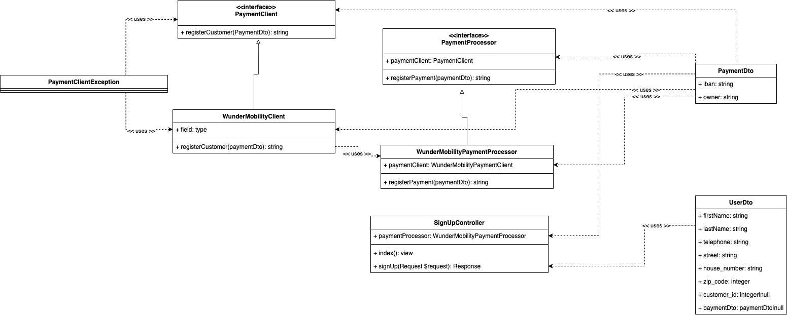

## Coding Challenge Wunder Mobility

### Setup

#### Requirements

- Docker
- GIT

#### Build application

1. Run docker-compose up
2. Enter container ```make enter-app```
3. cd into public ```cd public``` / inside container
4. run migrations ```php artisan migrate``` / inside container
5. install dependencies run ```composer install``` / inside container

#### Run tests

````make tests````

#### Accessability

- Server: http://localhost:25000
- Form for signup: http://localhost:25000/signup

#### Implementation
Here is a simplified UML class diagram to show the main classes I used to design the backend.
Please note that this is only a simplified representation. Many other classes are used in the real implementation.




### Questions

#### 1. Describe possible performance optimizations for your Code.

- I am using 3 retries when calling the payment endpoint. If the endpoint is slow or for split second not reachable the
  user has to wait.
- Frontend performance can be increased with a proper framework. I am using raw js, jquery and including libraries via
  CDNs.

#### 2. Which things could be done better, than you’ve done it?

- I am not validating the data in the backend. When you place a direct CURL request there could be a failure.
- I can definetly improve the frontend. Using a frontend framework and splitting up the application would be more
  professional.
- I could have implemented a better exception handling solution. Currently throwing a custom exception and handling this
  exception directly inside the controller. 